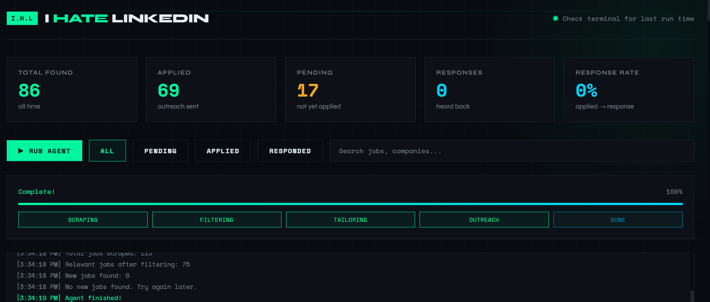

# Project I.H.L — I Hate LinkedIn

> I built an AI agent that hunts for jobs, finds the recruiter's real email, writes them a personalized message, and sends it — automatically. On one run it sent **210+ emails** to real hiring managers across Toronto.



---

## The Idea

Job portals are a black hole. You apply, you never hear back, you apply again.

So I skipped the portal and went straight to the source. I.H.L finds IT job listings, tracks down the actual recruiter at each company, uses AI to write a real personalized email for each role, and sends it — all while you watch it happen live from a dashboard.

---

## What Happens When You Run It

1. It searches for IT jobs in your city using the Adzuna job board API
2. It filters out anything irrelevant (senior roles, wrong industry, etc.)
3. For each new job, it finds a real recruiter email using Hunter.io
4. It sends the job details to Claude AI, which writes a custom outreach email
5. The email gets sent from your Gmail automatically
6. Everything gets saved to a database so you can track what was sent

You can watch all of this happen live in the dashboard at `localhost:5000`.

---

## Dashboard

The dashboard shows:
- How many jobs were found, applied to, and responded to
- A live log of what the agent is doing right now
- A table of every job with filters and search
- Buttons to manually mark jobs as applied or responded

---

## Tech Stack

| What it does | Tool used |
|---|---|
| Find jobs | Adzuna Jobs API |
| Find recruiter emails | Hunter.io API |
| Write outreach emails | Anthropic Claude AI |
| Tailor resume summaries | Anthropic Claude AI |
| Send emails | Gmail (via Python) |
| Store data | SQLite database |
| Run the dashboard | Flask (Python web server) |

---

## How to Run This (Step by Step)

Don't worry if you've never done this before. Follow each step exactly.

---

### Step 1 — Make sure Python is installed

Open your terminal (search "Terminal" on Mac, or "Command Prompt" / "PowerShell" on Windows) and type:

```
python --version
```

If you see something like `Python 3.10.x` you're good. If not, download Python from [python.org](https://python.org) and install it. Make sure to check **"Add Python to PATH"** during installation.

---

### Step 2 — Download this project

Click the green **Code** button at the top of this page and click **Download ZIP**. Unzip it somewhere easy to find, like your Desktop.

Or if you have Git installed:
```
git clone https://github.com/Regsaila/project-ihl.git
```

---

### Step 3 — Open the project folder in your terminal

On Windows, open the folder, click the address bar at the top, type `cmd` and press Enter.

On Mac, right-click the folder and select "New Terminal at Folder".

---

### Step 4 — Install the required libraries

Paste this into your terminal and press Enter:

```
pip install -r requirements.txt
```

This installs everything the project needs. Wait for it to finish.

---

### Step 5 — Get your API keys

The project needs accounts and API keys from 4 services. All have free tiers.

| Service | What it's for | Sign up link |
|---|---|---|
| Anthropic | AI that writes the emails | [console.anthropic.com](https://console.anthropic.com) |
| Adzuna | Job listings | [developer.adzuna.com](https://developer.adzuna.com) |
| Hunter.io | Recruiter email lookup | [hunter.io](https://hunter.io) |
| Gmail | Sending the emails | You probably have this already |

For Gmail you need an **App Password** (not your regular password):
1. Go to your Google Account → Security
2. Turn on 2-Step Verification if it isn't already on
3. Search for "App Passwords" in Google settings
4. Create one, name it whatever, copy the 16-character password it gives you

---

### Step 6 — Create your `.env` file

In the project folder, create a new file called exactly `.env` (with the dot, no other extension).

Paste this inside and fill in your actual keys:

```
ANTHROPIC_API_KEY=paste_your_anthropic_key_here
ADZUNA_APP_ID=paste_your_adzuna_app_id_here
ADZUNA_APP_KEY=paste_your_adzuna_app_key_here
HUNTER_API_KEY=paste_your_hunter_key_here
EMAIL_ADDRESS=your_gmail@gmail.com
EMAIL_PASSWORD=your_16_character_app_password
```

Save the file. **Never share this file or upload it to GitHub.**

---

### Step 7 — Customize your job search (optional)

Open `main.py` in any text editor. Near the top you'll see:

```python
JOB_TITLES = [
    "IT Technician",
    "Network Administrator",
    "IT Support",
    "Junior Network Engineer"
]
LOCATION = "Toronto"
```

Change these to whatever job titles and city you want to search for.

If you want to test without sending real emails first, change:
```python
DRY_RUN = False
```
to:
```python
DRY_RUN = True
```

---

### Step 8 — Run the dashboard

In your terminal, type:

```
python server.py
```

You should see:
```
Dashboard running at http://localhost:5000
```

Open your browser and go to **http://localhost:5000**

Click **RUN AGENT** and watch it go.

---

### Step 9 — Track your applications

As the agent runs you'll see emails going out in real time. Once it finishes:

- **Applied** = outreach email was sent to a recruiter
- **Pending** = job was found but not yet processed
- When a recruiter replies to you, click **Response** on that job to mark it

---

## Project Structure

```
project-ihl/
├── main.py               # The agent — runs the whole pipeline
├── server.py             # Web server for the dashboard
├── dashboard/
│   └── index.html        # The dashboard UI
├── modules/
│   ├── scraper.py        # Finds jobs from Adzuna
│   ├── tailor.py         # Uses Claude to tailor your resume summary per role
│   ├── outreach.py       # Finds recruiter emails, writes and sends outreach
│   └── database.py       # Saves and retrieves job data
└── jobs.db               # Your job tracking database (auto-created on first run)
```

---

## Important Notes

- This sends **real emails** from your Gmail. Use `DRY_RUN = True` to test first.
- Hunter.io free tier gives you 25 searches/month. Upgrade if you need more volume.
- Sending large batches from a personal Gmail may trigger spam filters — run in batches of 50-100.
- This handles **recruiter outreach only** — it does not auto-fill and submit applications on job websites.

---

## Built By

**Ali Saifee** — Network Engineering student, Sheridan College  
[LinkedIn](https://linkedin.com/in/ali-saifee-860224211) · [GitHub](https://github.com/Regsaila)
